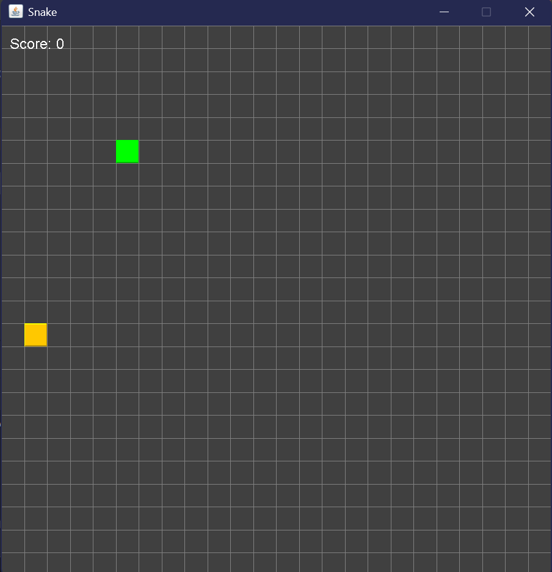
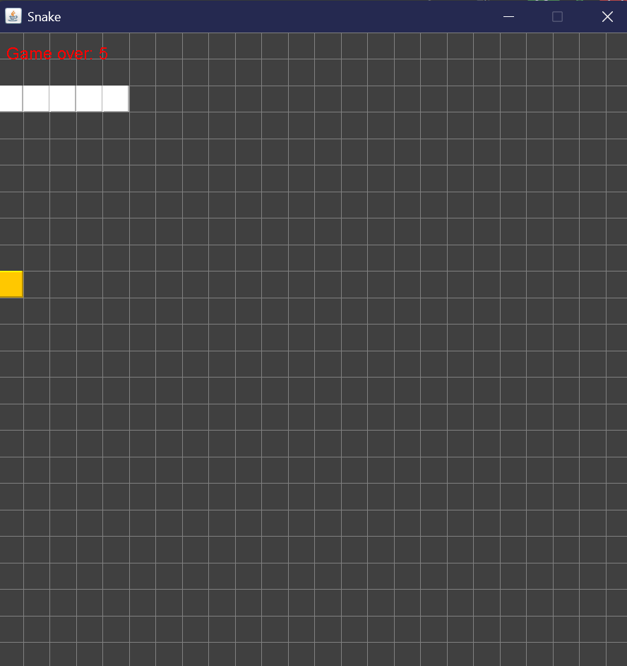
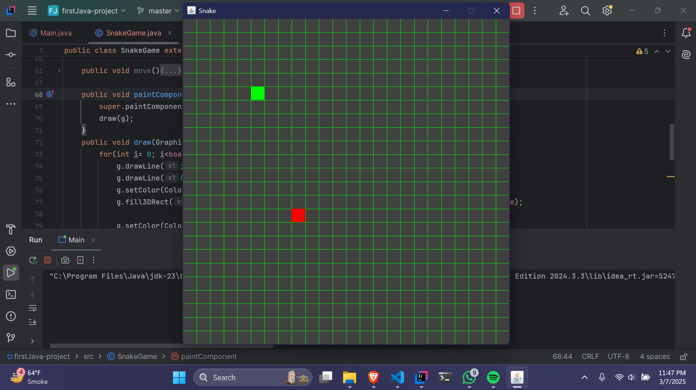

# Snake Game

This is a simple Snake Game implemented in Java using `javax.swing` for GUI. 
The game allows users to control 
- A snake to collect food on the board.
- Grow in size by eaiting food.
- Avoid colliding with itself or the board's edges.

---

## 1. How the Game Works

- The snake starts as a single square on the grid.
- Food appears randomly on the board, and the snake must move to collect it.
- Each time the snake collects food, it grows in size.
- The game ends if the snake collides with the board edges or with itself.
- You can pause or resume the game at any point by pressing the **Spacebar**.

---

## 2. How Keys Play a Role in the Game

| Key         | Action                                    |
|-------------|------------------------------------------|
| **Up Arrow**    | Moves the snake one step upward.        |
| **Down Arrow**  | Moves the snake one step downward.      |
| **Left Arrow**  | Moves the snake one step to the left.   |
| **Right Arrow** | Moves the snake one step to the right.  |
| **Spacebar**    | Pauses or resumes the game.            |

---

## 3. How to Run the Game Manually

### Prerequisites
- Java Development Kit (JDK) installed.
- A code editor or IDE like IntelliJ IDEA, Eclipse, or VS Code.

### Steps
1. Copy the game source code into a file named `SnakeGame.java`.

2. Compile both files using the following command in the terminal or command prompt:

```sh
javac SnakeGame.java Main.java
```

4. Run the game using the following command:

```sh
java Main
```

---

## 4. Screenshots

### a. Start of the Game


### b. Game Running


### c. Game Over



---

## Features
- Grid-based board for the snake to navigate.
- Random food generation.
- Adjustable speed via the `Timer` interval.
- Pause and resume functionality.
- Smooth gameplay with single-step movement.
- Game-over detection for collisions with edges or the snake's body.

---

## Future Contribution
Feel free to fork this repository and improve the game with additional features, such as:
- Increasing difficulty over time.
- Adding sound effects.

---

## License
This project is open-source and free to use for learning or personal purposes.


#

